# Outpost, a walkthrough

Outpost is a local training gym for enterprise API troubleshooting. One process on one
port serves four faithful mock platforms (GitHub REST, Google OAuth 2.0, Glean, Slack), a
built-in Postman-style client, and a curriculum of tickets to solve against them. Every
value in every ticket is generated fresh per run, so a remembered answer never works twice;
you have to diagnose from evidence each time.

This is a tour of one session, in the order a first run actually goes. Every screenshot
below is a real capture of the app at 1440 x 900, taken against a fresh data directory.

To follow along:

```
npm install
npm run build && npm start
```

Then open `http://localhost:4600`.

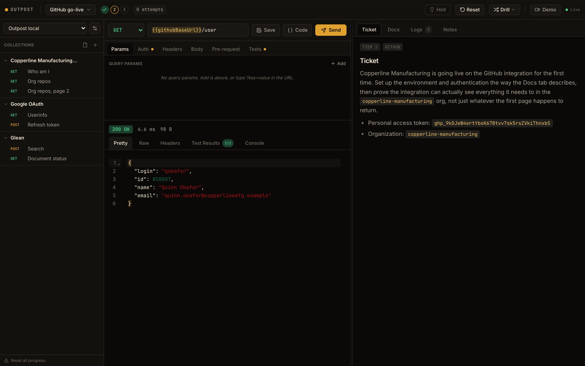

## 1. The shell

Three columns and a bar.

- **Top bar.** The scenario picker, a chip per step (they turn green as steps pass), an
  attempt counter, and the Hint, Reset, Drill, and Demo controls. The dot at the far
  right is the live event stream from the server; the whole premise of this app is that
  requests which never touched this browser still move this bar.
- **Left.** Collections and the active environment, the way Postman lays them out.
  `{{variables}}` resolve from the environment everywhere a URL, header, or auth field
  is typed.
- **Middle.** The request builder (Params, Auth, Headers, Body, Pre-request, Tests) and
  the response panel (Pretty, Raw, Headers, Test Results, Console).
- **Right.** The reference panel: Ticket, Docs, Logs, Notes.

The divider between the middle and right columns drags.

## 2. Pick a scenario

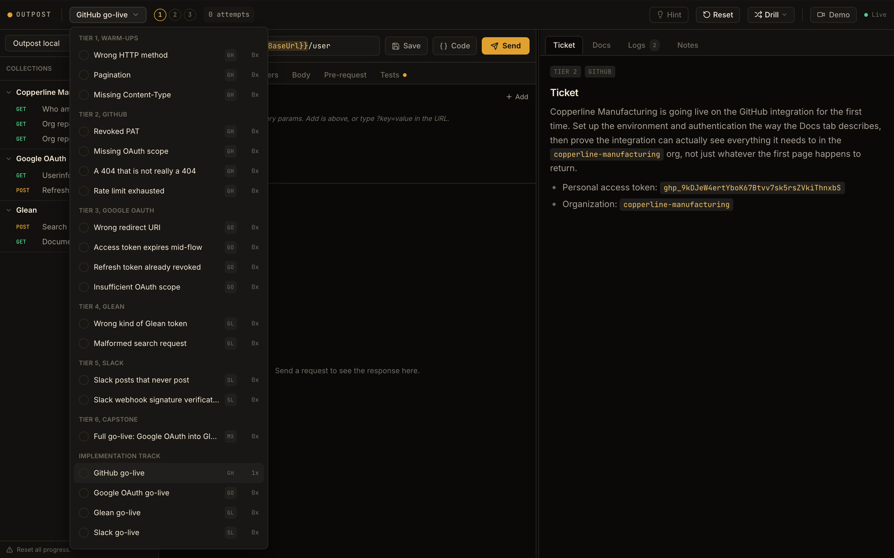

Twenty scenarios. Sixteen are troubleshoot-track, grouped into six tiers that climb from
warm-ups (wrong HTTP method, pagination, a missing `Content-Type`) through GitHub auth,
Google OAuth, Glean, and Slack, up to a single tier 6 capstone. Four more form the
implementation track, one go-live checklist per platform, with nothing broken to find.

Each row carries a platform tag, a solved checkmark, and a run count. Every activation
reseeds the run, so the same scenario twice is two different tickets.

## 3. Read the ticket, then the docs

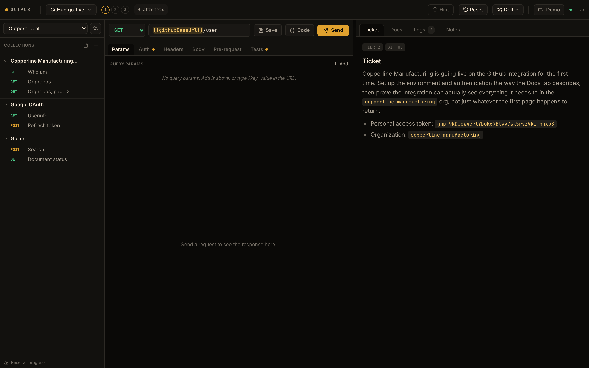

A ticket describes a situation, never a fix. The troubleshoot track hands you a support
ticket; the implementation track hands you a go-live checklist. Whatever credentials or
identifiers are on file are listed right there, generated for this run.

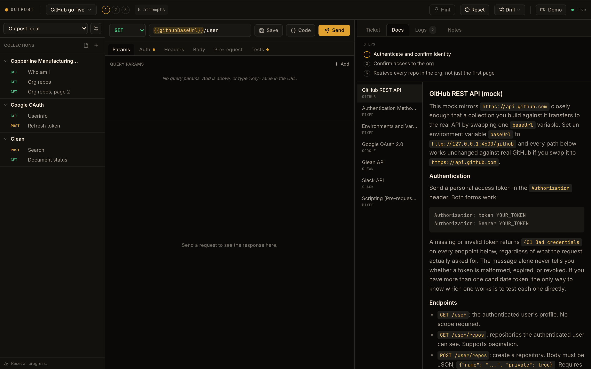

The Docs tab carries reference documentation for whichever platform the scenario touches,
written to be enough on its own. The implementation-track scenarios are specifically
designed to be solvable from this tab alone.

## 4. Build the request

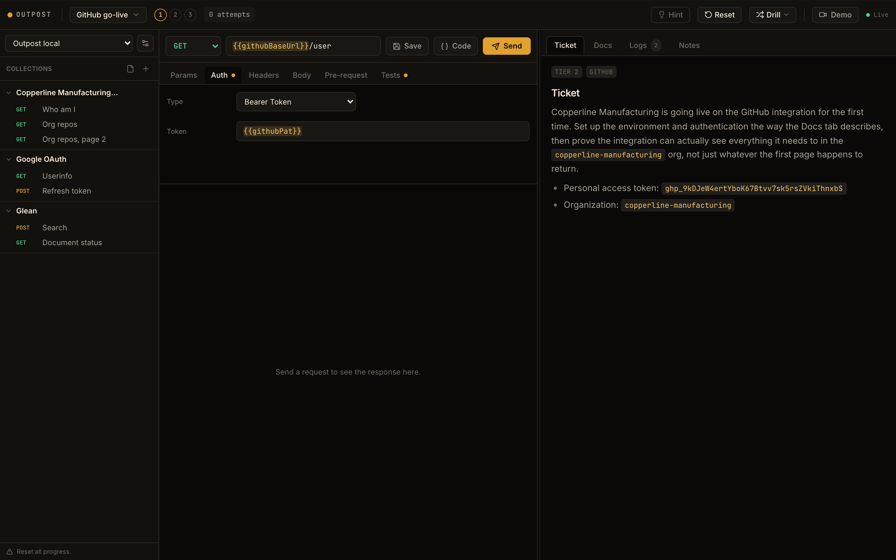

The Auth tab supports No Auth, Bearer Token, Basic Auth, API Key, and OAuth 2.0. Here the
token is `{{githubPat}}` from the active environment, and the URL is
`{{githubBaseUrl}}/user`. Every path under a platform base is byte-identical to the real
product's, so a collection built here transfers to the real API by swapping four base
URLs.

## 5. Send

Send it and three things happen at once: the response lands in the panel, the first step
chip in the bar turns green, and the Tests script you wrote against the response runs.

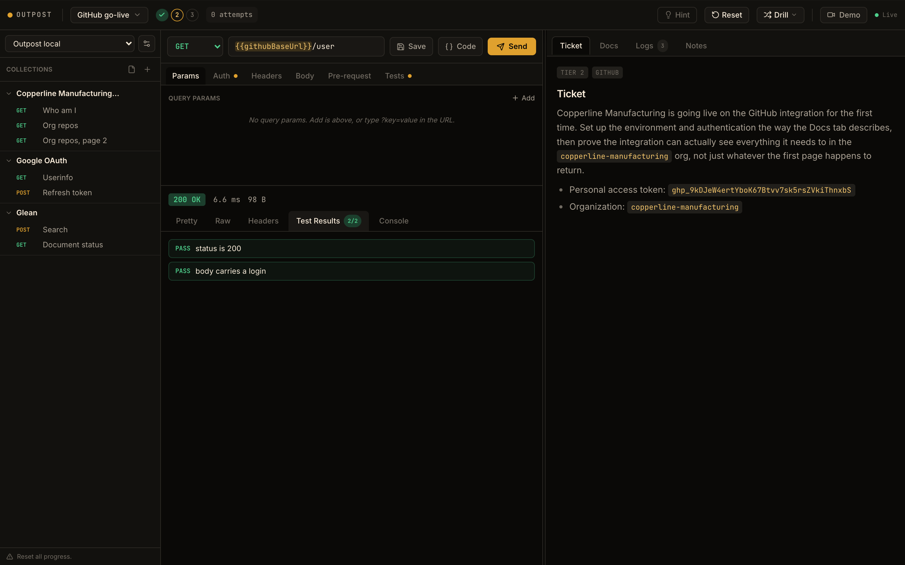

The script engine runs `pm.test`, `pm.expect`, `pm.response`, and `pm.environment` in a
sandboxed Web Worker with a hard timeout. Real `crypto-js` is available, so an HMAC
signature computed in a pre-request script works the way it does in Postman. One rule
shapes the whole design: the server never reads your test results. A scenario passes on
what actually hit the wire, because real Postman's test results are invisible to the server
too.

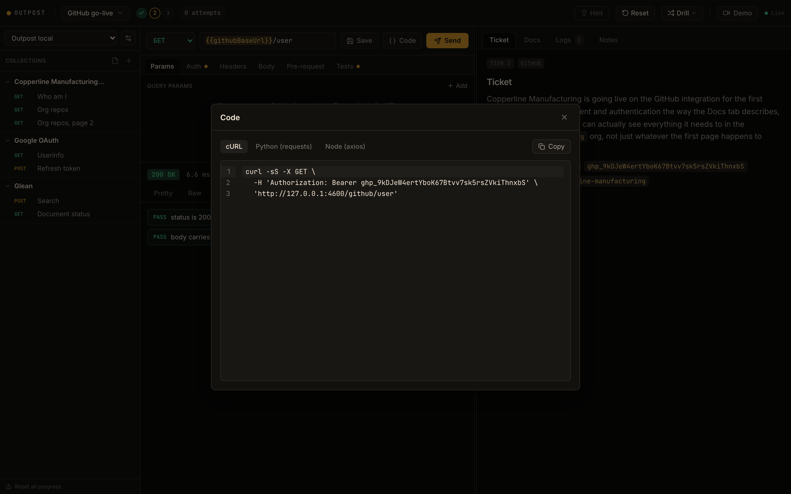

`</> Code` exports the exact request the Send button would make, as cURL, Python
`requests`, or Node `axios`.

## 6. Any client counts

This is the design decision everything else hangs on. Detection is a single piece of
server-side middleware, so it does not matter which client sent the request. In the run
below, step 1 was sent from the built-in client. Steps 2 and 3 were sent from outside the
browser entirely, a plain HTTP client following the `Link` header through every page of
the org's repo list. All three chips are green.

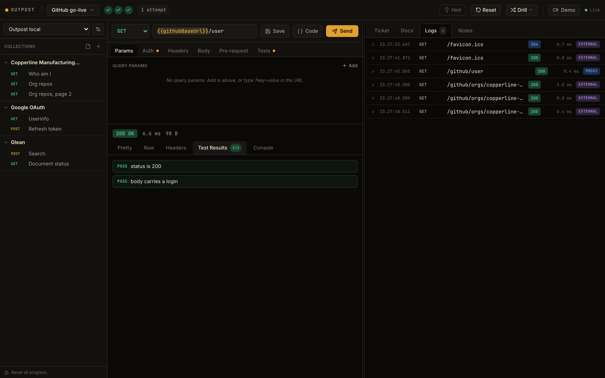

The Logs tab shows every request that reached the mock, tagged PROXY (sent through the
built-in client) or EXTERNAL (anything else: real Postman desktop, cURL, a script). Point
real Postman at the same four base URLs and it registers identically.

## 7. Explain it back

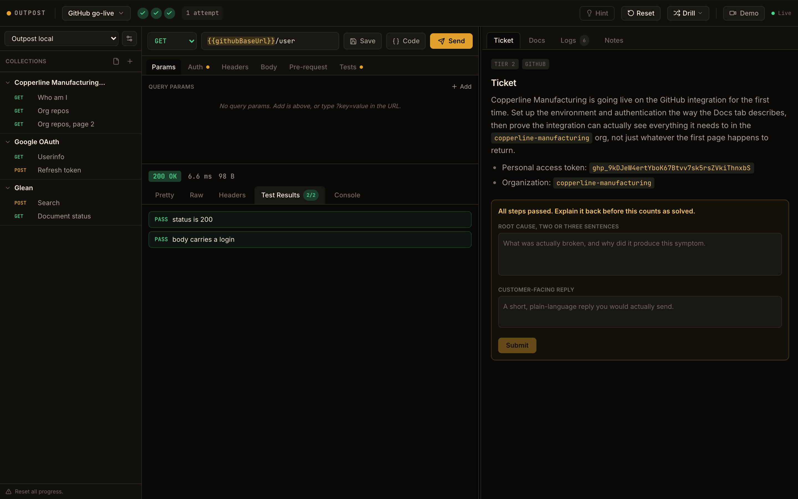

Every step passing is not the end. Before the scenario counts as solved, you write a
two-or-three-sentence root cause and a short customer-facing reply, the same discipline a
real support handoff needs. Both are saved with your progress.

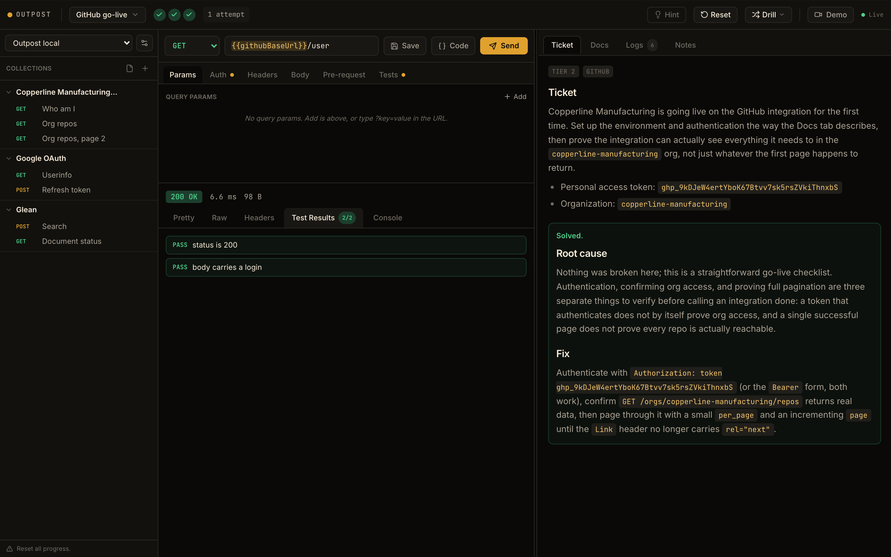

Submit, and the solution reveals: what was actually wrong (or, on the implementation
track, why each verification step mattered) and the fix, with this run's real values.

## 8. When it does not work

Switch to the troubleshoot track. This ticket says two personal access tokens are on file
and exactly one still authenticates.

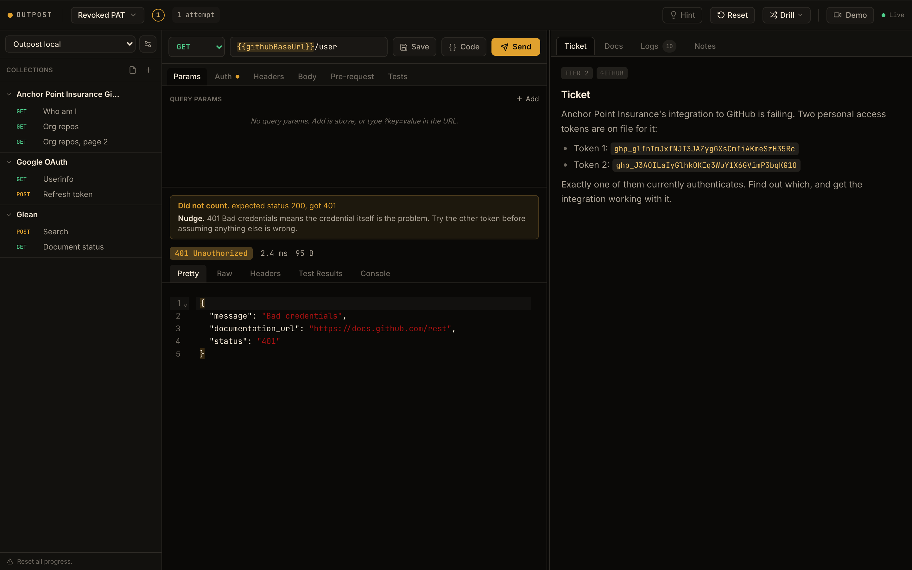

When a request matches the current step but fails its assertions, you get a real reason,
never silence: "expected status 200, got 401". Some steps also carry a nudge that points at
the kind of thing to check next without naming the answer.

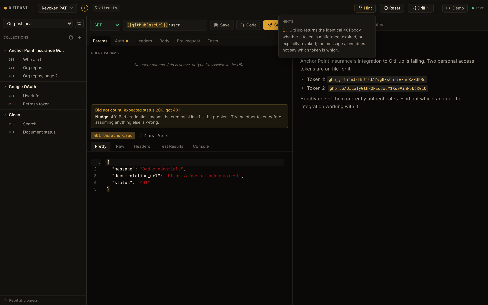

Three failed attempts unlock the first hint; six and nine unlock the next two.
An amber dot on the Hint button marks a hint waiting to be claimed. Hints narrow the
search without handing over the fix.

## 9. Drill mode

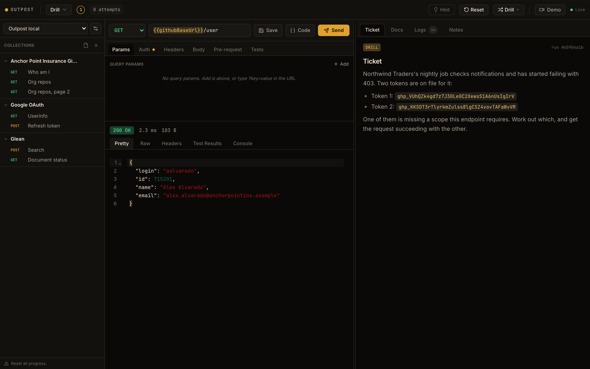

Drill picks a random troubleshoot-track scenario (any tier, or a tier you choose) and hides
its identity. The picker just says Drill, the ticket carries no tier or platform tag, and
the step chips are anonymous. You solve it from the ticket and the logs alone, the way a
cold escalation actually arrives.

## 10. The capstone, and Demo mode

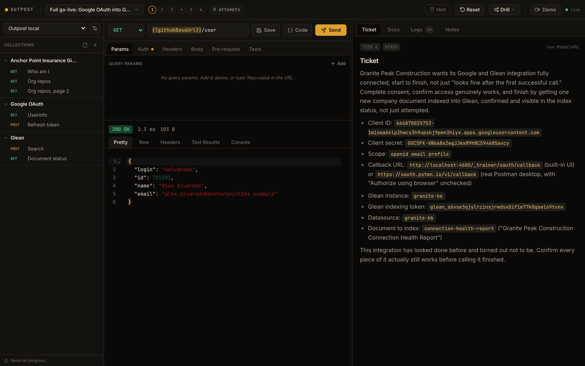

The capstone chains a live OAuth consent, a working token, a refresh that succeeds, the
identical refresh failing with `invalid_grant` because something changed on the server's
side, a genuine re-auth, and a Glean indexing job confirmed by a status check that returns
a real payload. It is built to be screen-recorded end to end in one take.

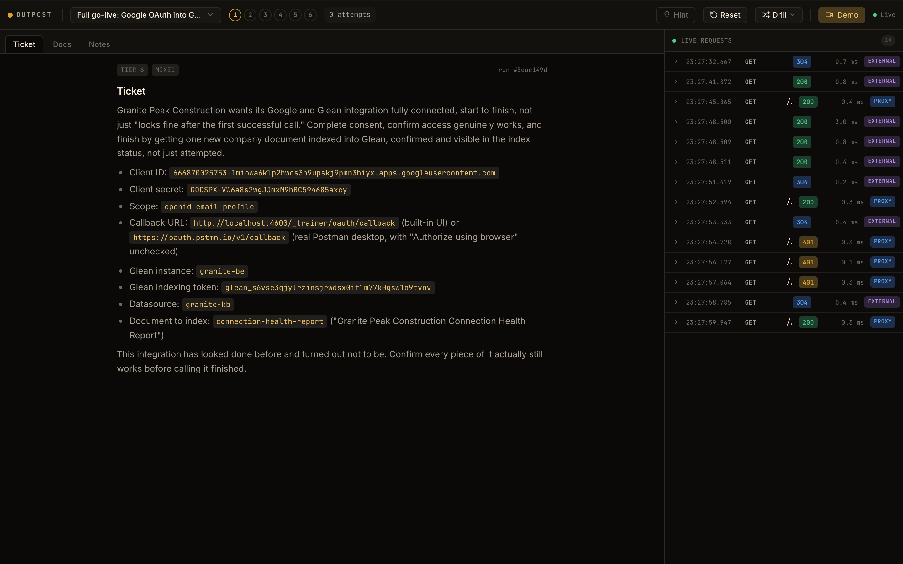

Demo mode (`Cmd+\`) collapses the built-in client, leaving the ticket at full width with a
live log column beside it. It is the companion view for a rep done in real Postman desktop
on the other half of the screen.

## 11. OAuth 2.0, end to end

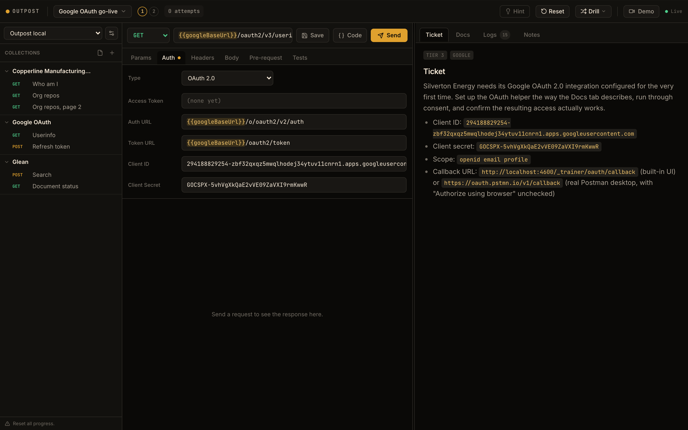

The OAuth 2.0 auth type mirrors Postman's helper: auth URL, token URL, client id and
secret, scope, callback URL, and a Get New Access Token button.

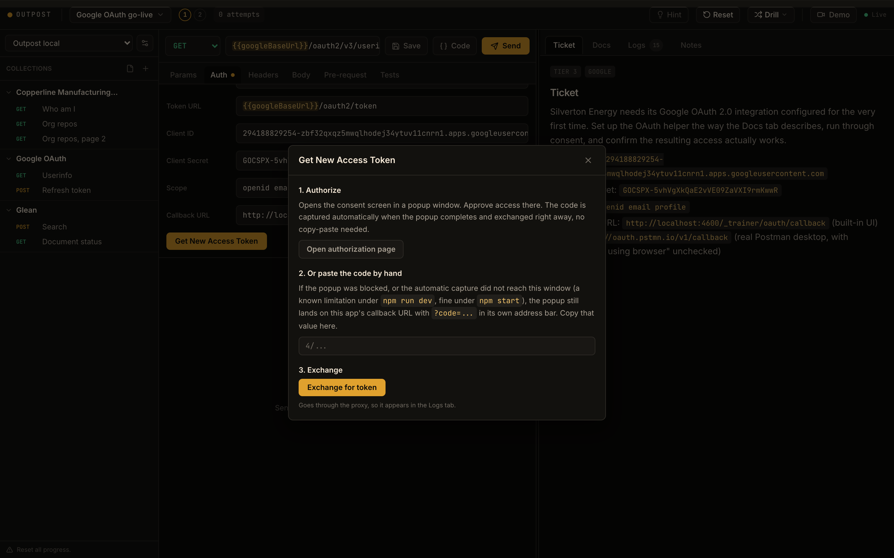

The modal opens the consent screen in a popup. If the popup is blocked, or you are running
under `npm run dev` where the split origins cannot deliver the callback, the code can be
pasted by hand instead.

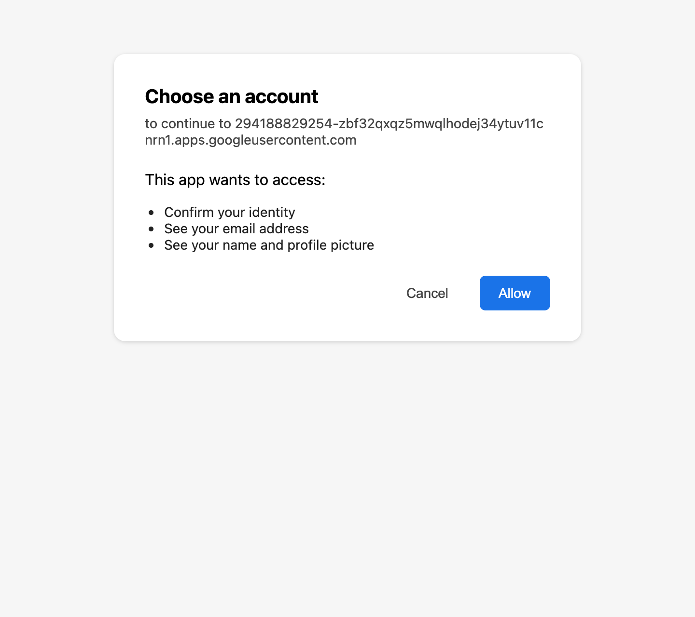

The consent screen is served by the Google mock. Two callback URLs are registered:
`http://localhost:4600/_trainer/oauth/callback` for the built-in UI's popup, and
`https://oauth.pstmn.io/v1/callback` for real Postman desktop (with "Authorize using
browser" unchecked, so Postman intercepts the navigation itself). Anything else fails with
an exact-match `redirect_uri_mismatch`, the way the real thing does.

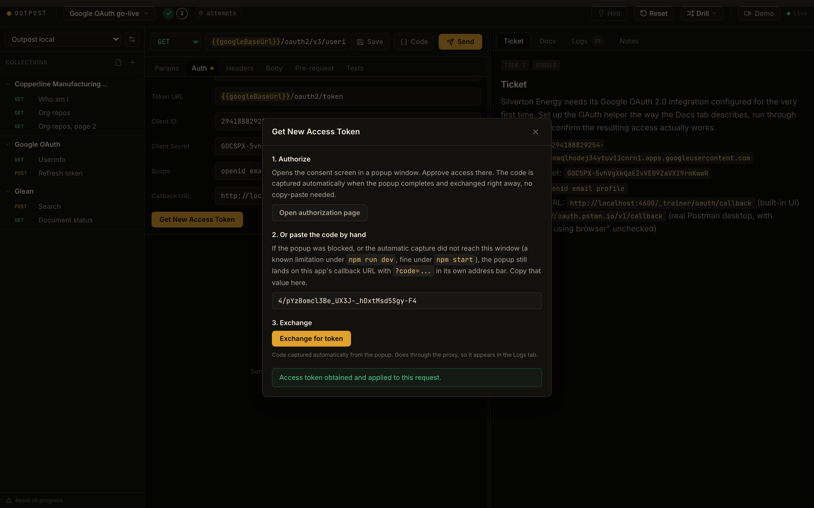

Approve, and the code is captured from the popup and exchanged right away; the exchange
goes through the proxy, so it shows up in Logs like any other request.

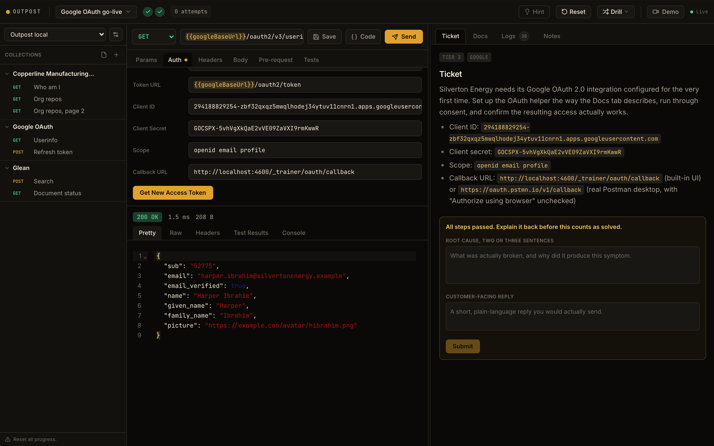

Send `GET {{googleBaseUrl}}/oauth2/v3/userinfo` with the new token and the identity
comes back. Both steps of the go-live pass, and the explain-back prompt is waiting.

## 12. Progress

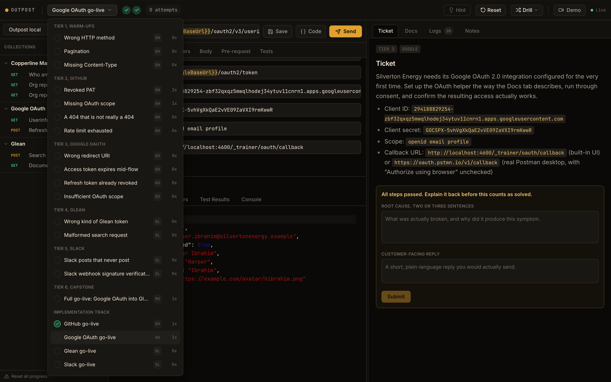

Solves, run counts, attempt counts, and every explain-back you have written persist in
`data/progress.json`. Collections, environments, notes, and the request you have open
persist in `data/workspace.json`. Both are gitignored. The per-scenario Reset in the top
bar reseeds the current run; the muted Reset all progress control in the sidebar footer
wipes solve history for every tier, and only after you type the exact confirmation phrase.

## Under the hood, briefly

- **Server.** Express, with the four platform routers mounted at `/github`, `/google`,
  `/glean`, `/slack`. Two pieces of middleware sit in front of all of them: a request log
  and a fault injector. The scenario engine watches the log, matches requests to the
  current step, runs assertions, and broadcasts state over a server-sent events stream.
- **Faults.** A scenario declares faults as either state (a token record flipped to
  revoked, a scope stripped) or intercepts (a response rewritten on the way out). A step
  can name faults to clear the moment it passes. The capstone uses that same hook in
  reverse: the first successful refresh is the step that fires it, and what fires is the
  revocation, so the identical refresh a moment later fails.
- **Per-run generation.** Company names, users, organizations, repos, tokens, client ids,
  Glean instances, document titles: all derived from a fresh seed on every activation.
- **Client.** React, served as a built bundle from the same port under `npm start`. The
  scripting sandbox is a Web Worker with the global scope's network and storage
  capabilities removed along the whole prototype chain, not just shadowed.
- **No real credentials, no real network calls.** Nothing here contacts GitHub, Google,
  Glean, or Slack.
